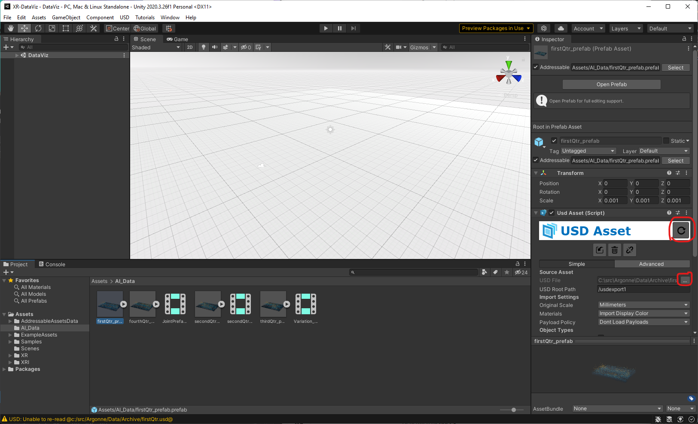
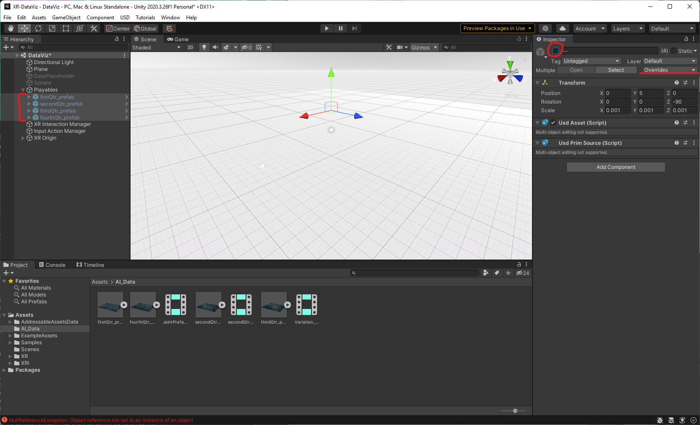

# XR Data Viz
## Intro
This Unity project allows a user to view USD assets using XR devices like the Meta Quest 2.

## Setup
### Prereqs
- Unity 2020.3.26f1 with Android Build Support (Android SDK & NDK tools; OpenJDK)
- Download and unzip USD files from `/lus/grand/projects/visualization/ortizj/FourStitchedUsds.zip`

### Install
1. Clone this project, then ["Add an existing project from disk"](https://docs.unity3d.com/hub/manual/AddProject.html#add-an-existing-project-from-your-disk) with Unity Hub
1. Under `Project` tab, open `Assets`->`Scenes`->`DataViz`
1. Open `Assets`->`AI_Data`->`firstQtr_prefab.prefab` and in the `Inspector` tab, click the "..." button and choose the location of `firstQtr.usd` file downloaded before, then click the refresh button/icon. 
1. Repeat this for `secondQtr_prefab`, `thirdQtr_prefab`, and `fourthQtr_prefab`.
1. In the `Hierarchy` tab, expand the `Playables` GameObject, then multi-select the four child prefabs
1. In the `Inspector` tab, click the `Overrides` drop-down list and then click "Revert all" so that the updated USD paths are used instead. Then uncheck the `Active` GameObject box so that all four prefabs are inactive. 
1. To validate, select the `Playables` GameObject, open `Window`->`Sequencing`->`Timeline`, and click the `play` button. You should see the data animating and the timeline playing.

## Play in XR
For now, this app has been tested only on a Meta Quest 2 tethered via USB-C. Assuming the Oculus app is installed on your machine and you have added your Quest device, simply press the main `Play` button of the Unity editor to send it to your Quest.